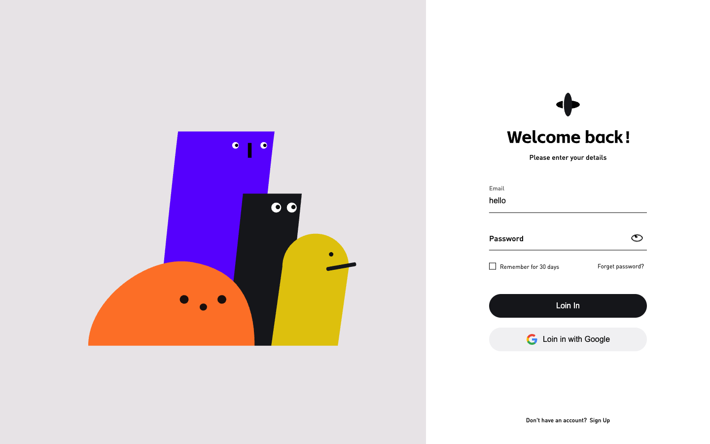
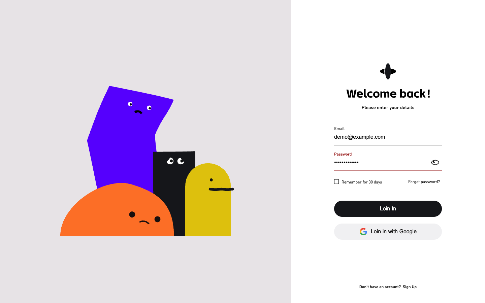

# 趣味登录页

一个使用原生 HTML、CSS、JavaScript 和 Rive 制作的登录交互演示。左侧的四个几何角色会随着表单聚焦、密码显示切换和提交动作改变姿态与表情，右侧提供邮箱、密码和动画眼睛按钮。

当前项目用于展示页面和动画交互，尚未接入账号系统或登录接口。填写有效邮箱和非空密码后，提交会固定演示密码错误，不存在可登录成功的测试账号。

## 快速开始：直接运行，无需打包

### 1. 准备 Node.js 和 npm

先安装 Node.js（安装时会同时提供 npm）。当前 Vite 8.0.3 要求 Node.js 版本满足 `^20.19.0 || >=22.12.0`，例如 Node.js 22.12+ 或 24。

在终端检查是否已经安装：

```bash
node --version
npm --version
```

### 2. 下载项目并安装依赖

```bash
git clone https://github.com/xingxingbk-git/playful-login-ui.git
cd playful-login-ui
npm ci
```

也可以在 GitHub 仓库页面选择 **Code → Download ZIP**，解压后在包含 `package.json` 的文件夹中打开终端，执行 `npm ci`。已经下载项目的用户可以跳过克隆步骤。

`npm ci` 用于安装项目所需的依赖，第一次运行项目时需要执行；依赖文件更新后也需要重新安装。

### 3. 启动页面

```bash
npm run dev
```

保持终端运行，在浏览器中打开终端显示的 **Local** 地址，通常是 `http://localhost:5173/`。如果端口被占用，Vite 会尝试其他端口，请以实际输出为准。

也可以使用以下命令在启动时自动打开浏览器：

```bash
npm run dev -- --open
```

这个方式直接运行项目源码，**不需要执行 `npm run build`，也不会生成 `dist/` 构建目录**。以后再次启动时，在项目目录执行 `npm run dev` 即可；结束运行时，在终端按 **Ctrl + C**。

页面打开后，聚焦邮箱或密码框可以观察左侧角色的输入姿态；点击眼睛按钮可以切换密码显示；填写有效邮箱和任意非空密码，再点击页面上的 **Loin In** 按钮，可以体验密码错误动画。

### 为什么需要启动本地服务器？

页面入口是 `index.html`，但 `script.js` 通过 `import` 引用了 npm 包 `@rive-app/canvas`，同时需要加载 Rive 动画文件。Vite 开发服务器负责处理这些模块和资源，因此当前项目应使用上面的命令运行，直接双击 HTML 或只启动一个普通静态文件服务器无法完整运行。

当前页面会从 Google Fonts 加载字体，Rive 运行时默认从 CDN 加载 WASM，因此首次加载需要网络连接。观察左侧插画时，请使用宽度超过 900px 的浏览器窗口；窄屏布局会隐藏插画。

## 页面效果

以下图片均来自实际运行的页面，桌面视口为 **1440 × 900**。截图使用虚构的演示邮箱与密码；Rive 持续播放，图片只展示动画中的某一帧，角色的眼神也会受鼠标位置影响。

### 1. 正常状态

打开页面，不聚焦输入框。左侧角色保持默认姿态，右侧表单为空。


### 2. 表单输入状态

聚焦邮箱框并输入 `hello`，浮动标签上移，左侧角色向表单方向倾斜。这里使用尚未输入完整的邮箱，以便单独观察输入状态。



### 3. 显示密码状态

点击密码框右侧的眼睛按钮，密码变为明文，眼睛图标播放对应动画，左侧橙色角色闭眼，其他角色也切换表情与姿态。再次点击可以隐藏密码；切换后焦点保留在密码框，光标移到内容末尾。


### 4. 密码错误状态

填写有效邮箱和非空密码，保持密码隐藏，再点击页面上的 **Loin In** 按钮。密码标签与下划线变红，输入区域晃动，同时向左侧 Rive 动画发送 `wrong` 触发。

下图是在实际点击登录按钮后约半秒截取的错误动画：紫色角色身体弯曲，橙色角色露出难过的表情，其余角色也出现相应的眼神和嘴形变化。`wrong` 是一次性触发，错误动画播放后会回到默认姿态，红色错误样式则保留。重新输入密码即可清除错误样式，也可以再次提交来重播反馈。



## 已实现的交互

- 邮箱或密码输入框聚焦时，左侧 Rive 切换到输入状态。
- 输入符合格式的邮箱时，触发 `correct` 动画反馈；这只是格式检查，不代表登录成功。
- 密码显示与隐藏联动左侧角色和右侧 Rive 眼睛图标。
- 输入标签在聚焦或有内容时上移，浏览器自动填充使用白色背景。
- 提交时演示密码错误，支持重复晃动与重新输入后清除错误样式。
- 鼠标移动事件传递给两个 Rive 画布，用于动画内部的跟随交互。
- 窗口尺寸变化时更新画布绘制尺寸；视口宽度 **不超过 900px** 时隐藏左侧插画，只显示表单。

## 发布网站时再构建（可选）

本地体验和修改页面使用 `npm run dev` 即可。只有需要生成用于静态托管的文件，或检查构建后的版本时，才执行：

```bash
npm run build
npm run preview
```

`npm run build` 将页面、脚本、样式和 `public/` 中的资源整理到 `dist/`；`npm run preview` 用于本地检查这份构建结果，地址通常是 `http://localhost:4173/`，以终端输出为准。`preview` 需要先构建，不能替代直接运行源码的 `dev` 命令。

`dist/` 是可重新生成的构建产物，已在 `.gitignore` 中忽略，不需要提交到源码仓库。日常开发修改根目录源码和 `public/` 中的资源；部署时使用完整的 `dist/` 目录，并注意本文后面的子路径资源说明。

## 项目结构

```text
.
├── index.html                 # 页面结构与表单
├── script.js                  # Rive 初始化、表单事件和错误反馈
├── styles.css                 # 布局、浮动标签、晃动动画和窄屏样式
├── vite.config.js             # Vite 配置，base 为 ./
├── package.json               # 依赖和运行命令
├── package-lock.json          # npm 依赖版本锁定
├── public/
│   ├── riv/
│   │   ├── 插画.riv           # 左侧角色动画
│   │   └── eyes.riv           # 密码显示/隐藏的眼睛动画
│   └── svg/
│       ├── logo.svg
│       └── welcome back.svg
├── docs/
│   └── screenshots/           # 本 README 使用的页面截图
└── README.md
```

技术栈为原生 HTML / CSS / JavaScript、`@rive-app/canvas` 和 Vite。当前锁定版本分别为 Rive Canvas **2.36.0**、Vite **8.0.3**。

## Rive 如何与表单联动

两份动画都运行名为 `State Machine 1` 的状态机。页面优先通过 Rive ViewModel 绑定数据，主插画在找不到相应属性时回退到同名状态机输入。

### 左侧插画：`插画.riv`

使用名为 `Login` 的 ViewModel：

| 属性 | 类型 | 页面如何使用 |
| --- | --- | --- |
| `status` | Number | `0`：默认；`1`：邮箱或密码框聚焦；`2`：密码显示为明文 |
| `correct` | Trigger | 邮箱输入内容符合格式时触发 |
| `wrong` | Trigger | 表单错误或当前演示的密码错误提交时触发 |

`status = 2` 的优先级高于输入框聚焦状态：只要密码是明文，就保持显示密码的动画状态。主画布使用 `Fit.Cover` 与居中布局，填满左侧区域。

### 眼睛图标：`eyes.riv`

使用名为 `Eyes` 的 ViewModel，布尔属性 `display` 与密码框类型同步：

| `display` | 密码框类型 | 页面效果 |
| --- | --- | --- |
| `true` | `password` | 隐藏密码 |
| `false` | `text` | 显示密码 |

如果替换 `.riv` 文件，需要保持上述状态机、ViewModel 和属性名称一致，或同步修改 `script.js` 中的绑定逻辑。

## 当前功能范围与资源路径

- **登录**：目前所有有效提交都会进入密码错误演示。源码中保留的保存邮箱逻辑和 `simulateLogin()` 调用位于提交处理函数的提前 `return` 之后，当前流程不会执行。
- **Remember for 30 days**：可以勾选，但当前提交流程不会保存新的记住登录设置；初始化时仍会读取已有的本地记录。
- **Google 登录、忘记密码与注册**：当前为界面展示，尚未连接实际功能。
- **邮箱校验**：输入事件检查邮箱格式并触发动画；提交还受 HTML 原生 `type="email"` 和 `required` 校验约束，空值或无效邮箱可能先被浏览器拦截。
- **部署路径**：虽然 Vite 设置了 `base: './'`，`script.js` 中两份动画仍使用 `/riv/插画.riv` 与 `/riv/eyes.riv` 这样的根路径。部署到 `/项目名/` 等子路径时，需要同步调整动画资源地址，不能仅凭 `base` 配置判断动画可正常加载。
